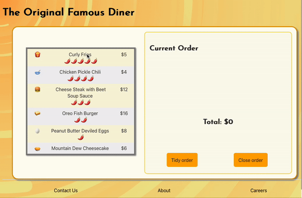

# React State Objects Lab

Edit multiple JavaScript files in this lab to refactor this app to have multiple components that function as expected.

---

## Lab Setup

### Getting started

1. Fork and clone this repository.

1. Navigate to the cloned repository's directory on your command line. Then, run the following command:

   ```
   npm install
   ```

   This will install the libraries needed.

1. Open up the repository in VSCode. Follow the instructions below to complete the Lab.

1. Deploy this application to Netlify and add the link to your netlify site below:

- [MY LIVE SITE URL](https://monumental-meerkat-286864.netlify.app/)

#### Testing Tips

Keep the following in mind for this lab as you run the tests.

1. The application mockups below are a design reference for if you have time. The main purpose of this lab is to connect all the components and get the tests to pass.

1. While running your tests, you must have a server up and running in another terminal. This means you will have _both_ a terminal window running the actual React application _and_ a terminal window running the tests.

1. When creating a component, make sure to create and import it with the same name as the file name. For example, the component created and exported inside of the `Post.js` file should be `Post`. The tests look for these specific names.

1. While the `cypress-watch-and-reload` package has been installed in this project, sometimes the React application will take longer to reload than the tests. If you feel as though a test should be passing that isn't, try pressing the re-run button in the Cypress tests before asking for help.

## Instructions

You will start with a static app. You will need to add JSX and functions to complete the functionality.

The app should:

- Generate a menu based on the data coming from `src/data.js`
  - The menu should be a table and each menu item should be in a `tr` (table row)
  - Within each `tr` should be three `td` elements:
    - The first will hold the menu item image
    - The second will hold the menu item name
    - The third will hold the menu item price
- The `td` with menu item name should have
  - a class of `item-name`
  - contain the item name in a `span` tag
  - contain a `br` tag between the item name and spice leve
  - contain a `span` tag that has the correct number of 🌶️ based on the `spiceLevel` property of the menu item.

```jsx
<td className="item-name">
  <span>ITEM NAME</span> <br></br>
  <span>Correct number of 🌶️, based on Spice level</span>
</td>
```

- When a menu item is clicked on, it should place the item in the `Current Order` section.
- When a menu item is added to `Current Order` the total cost should be updated.

- When the `Close order` button is pressed it should remove all the items in `Current order` and reset the total to 0.

- When the ❌ is pressed on a Current Order item, it should remove the correct item and update the total correctly.



> **Note**: While it is likely tempting to make the `menu` and `Current order` into separate components (and would be best practice), you have not yet learned how to share state across components. Therefore, please build this entire app in the `App.js` file and do not split it into separate components.

## Bonuses

One of the main purposes of unit testing is to be able to add new features and functionality without breaking the code that exists (or at least alerting the developers that some code has broken).

While still having all the tests pass:

Make a `Tidy order` button that tidies the order so that

- It combines the same order items into one row and updates the total cost of multiples and adds how many of each item is ordered
- If an item is deleted
  - if there is only one, it removes it from the list
  - if there is more than one, it reduces the number of the item by one

Try to make the `Current order` section into its own component and pass down props. Move state, as needed.

Try to make the `Menu` into its own component. You will have to figure out how to share state with its sibling element `Current order`. This will be covered in a future lesson However, figuring out on your own will give you a better understanding.
